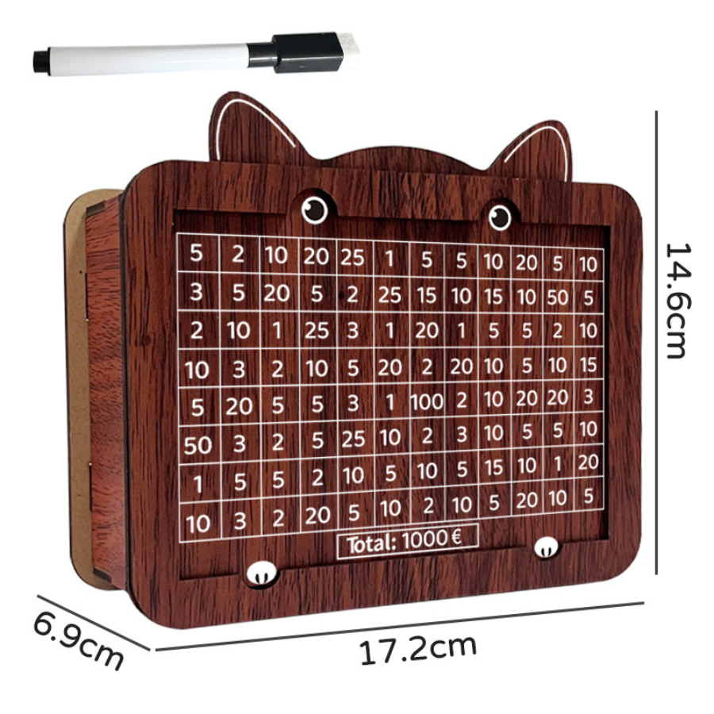

# 🐷 iSaBo - DIGITAL SAVING BOX

# Từ Hộp gỗ tiết kiệm đến Digital Saving Box


# 📖 Câu Chuyện Sản Phẩm

Bạn còn nhớ chiếc **Hộp gỗ bỏ tiền tiết kiệm** hồi nhỏ không? Mỗi ngày bỏ vào vài đồng tiền lẻ rồi đánh dấu và ô tương ứng; cuối năm mở ra "rút hầm bao" - đó là niềm vui giản dị mà thế hệ 8x, 9x chúng ta từng có.


**Digital Saving Box** được sinh ra từ chính ký ức ấy - mong muốn mang lại trải nghiệm tiết kiệm đơn giản, vui vẻ, nhưng phù hợp với thời đại số hóa ngày nay.


### 💡 Ý tưởng nảy sinh

Trong những ngày Tết, sấp nhỏ ở nhà ngoài việc ăn uống vui vẻ thì còn một niềm vui to lớn đó là "Đếm phong bao lì xì" và bỏ heo đất để tiết kiệm, tôi chợt nghĩ:
- Nếu việc tiết kiệm bằng cách bỏ heo đất rất dễ dẫn đến "hao hụt"(cái trò moi móc heo này thì thế hệ 8x, 9x của chúng tôi quá là điêu luyện) thì tại sao không chuyển sang dạng tiết kiệm trực tiếp vào một tài khoản online?"*

Từ đó, **iSabo - Digital Saving Box** ra đời - một ứng dụng kết hợp:
- 🎮 Trải nghiệm gamification (mở ô, cho heo ăn)
- 💰 Tính năng tiết kiệm thực tế (tích hợp VietQR thanh toán ngay)
- 🐷 Nhân vật đáng yêu (chú heo hồng nhắc nhở mỗi ngày)

## 🔄 Sự Chuyển Đổi

| Hộp Gỗ Truyền Thống            | Digital Saving Box                     |
|--------------------------------|----------------------------------------|
| 📦 Hộp gỗ cố định 1 mục tiêu   | 🎯 Nhiều mục tiêu tiết kiệm đồng thời |
| 💵 Bỏ tiền mặt vào ô           | 📱 Quét QR thanh toán ngay lập tức    |
| 📅 Một ô cố định mỗi ngày      | 🎲 Tự do chọn tile bất kỳ             |
| 🌐 Chỉ tiếng Việt              | 🇻🇳🇬🇧 Song ngữ Anh-Việt                 |

---

## ✨ Tính Năng Cốt Lõi

### 1. Glassmorphism UI
Giao diện hiện đại với hiệu ứng kính mờ, ripple animation sống động, mang lại trải nghiệm thị giác đẹp mắt.

### 2. Đa mục tiêu tiết kiệm
- Tạo nhiều "Mục tiêu tiết kiệm" (saving goal) khác nhau
- Mỗi Mục tiêu có "Số tiền mong muốn" riêng, đồng thời cũng được lựa chọn 01 tài khoản riêng (nếu có)
- Theo dõi tiến độ từng mục tiêu độc lập

### 3. Tích hợp VietQR
- Quét QR thanh toán trực tiếp từ app
- Hỗ trợ tất cả ngân hàng Việt Nam
- Giao dịch an toàn, tiện lợi

### 4. Thông báo thông minh
- Nhắc nhở hàng ngày vào giờ tùy chọn
- **Thông minh**: Nếu đã tiết kiệm hôm nay thì tự động hoãn thông báo
- Chú heo hoạt hình đáng yêu khi mở app từ notification

### 5. Saving Streak
- Đếm chuỗi ngày tiết kiệm liên tục
- Hiển thị thống kê tổng quan
- Khuyến khích duy trì thói quen

### 6. Song ngữ Anh-Việt
- Chuyển đổi ngôn ngữ linh hoạt
- Định dạng tiền tệ theo vị trí quốc gia ($ hoặc k)

## 🔐 Đánh Giá An Toàn & Bảo Mật

### Lưu trữ dữ liệu
- ✅ Dữ liệu lưu **local** trên thiết bị
- ✅ Thư mục: `Documents/DigitalSavingBox/data/`
- ✅ Không upload lên server bên thứ 3
- Sẽ hỗ trợ backup/restore qua file

### Xác thực
- Sẽ phát triển Tích hợp `local_auth` (vân tay, FaceID)
- Sẽ phát triển Bảo vệ truy cập vào app
- Sẽ phát triển Tùy chọn bật/tắt trong Settings

### VietQR
- ✅ Chỉ tạo mã QR chuẩn NAPAS
- ✅ Không lưu thông tin tài khoản ngân hàng
- ✅ Người dùng tự xác nhận sau khi đã chuyển khoản số tiền muốn tiết kiệm


## 📥 Cài Đặt & Sử Dụng

### Yêu cầu hệ thống
- Android 6.0+ (API 23+)
- 50MB dung lượng trống
- Kết nối Internet (chỉ khi tạo mã QR)

### Cài đặt từ source

```bash
# Clone repo
git clone https://github.com/user/digital_saving_box.git

# Di chuyển vào thư mục
cd digital_saving_box

# Cài dependencies
flutter pub get

# Chạy app
flutter run
```

### Tạo file APK để sử dụng trên thiết bị Android

```bash
flutter build apk --release
```

File APK sẽ nằm tại: `build/app/outputs/flutter-apk/app-release.apk`

---

## 🚀 Bắt đầu sử dụng

1. **Mở app** vào Cài đặt (Settings) chọn ngôn ngữ (EN/VN) và chọn các giá trị tiền tệ mong muốn tiết kiệm
2. **Tạo mục tiêu** đầu tiên (ví dụ: "Du lịch Đà Lạt")
3. **Chọn tile** bất kỳ để "cho heo ăn"
4. **Quét VietQR** để chuyển tiền thật vào tài khoản tiết kiệm
5. **Bật thông báo** để nhận nhắc nhở hàng ngày
6. **Duy trì streak** và đạt mục tiêu! 🎉

---

## 📧 Liên hệ

Nếu bạn có góp ý hoặc phát hiện lỗi, hãy tạo issue trên repo này hoặc liên hệ qua email.

---

*from duconmang43 with ❤️*
