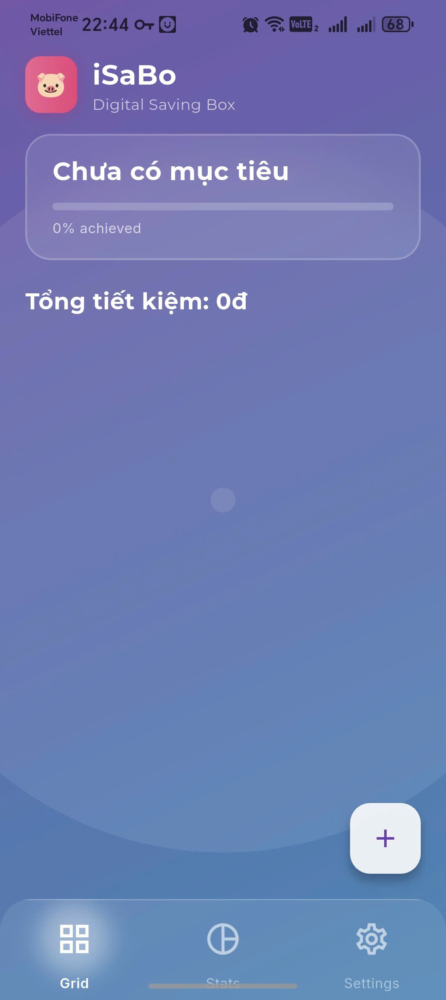
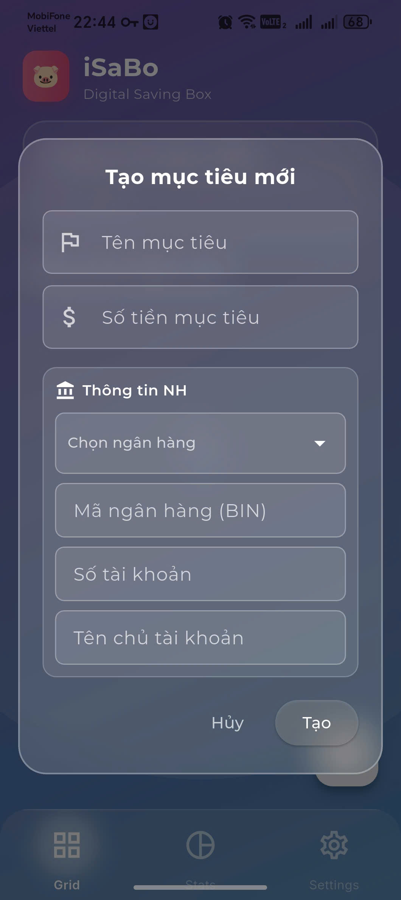
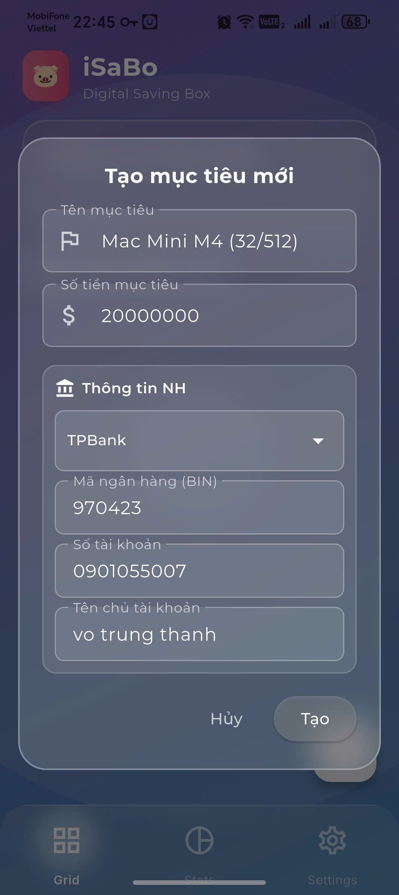
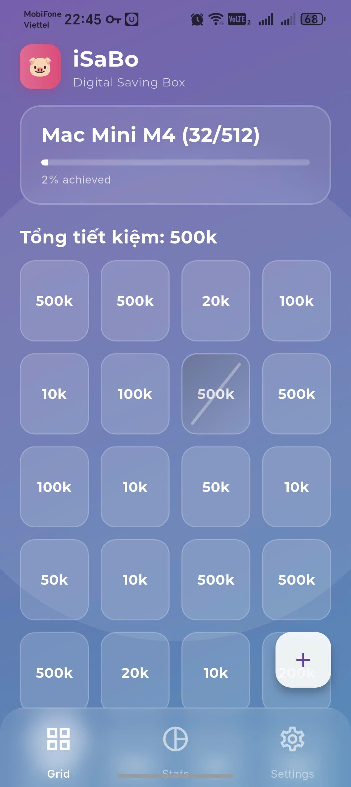
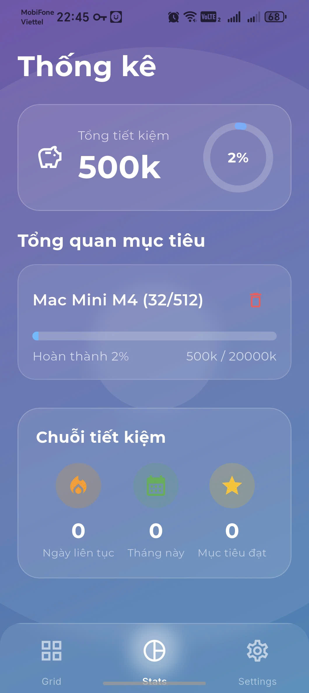
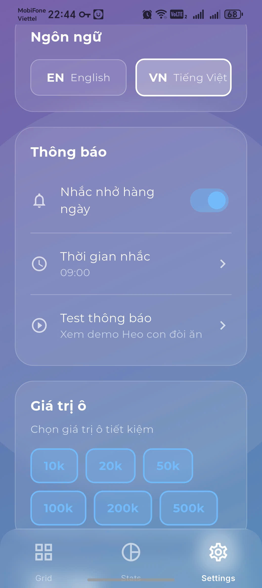

# 🐷 Digital Saving Box

> Ứng dụng tiết kiệm số hóa - Biến thói quen tiết kiệm thành game vui nhộn!

<p align="center">
  
</p>

## ✨ Highlights

- 🎨 **Glassmorphism UI** - Giao diện kính mờ hiện đại
- 🎯 **Multi-Goal** - Nhiều mục tiêu tiết kiệm đồng thời
- 📱 **VietQR** - Quét QR thanh toán ngay
- 🐷 **Smart Notifications** - Nhắc nhở thông minh với chú heo đáng yêu
- 🇻🇳🇬🇧 **Song ngữ** - Tiếng Việt & English

## 🚀 Quick Start

```bash
# Clone
git clone https://github.com/user/digital_saving_box.git
cd digital_saving_box

# Install dependencies
flutter pub get

# Run
flutter run
```

## 📦 Build APK

```bash
flutter build apk --release
```

Output: `build/app/outputs/flutter-apk/app-release.apk`

## 📖 Documentation

| Document                                           | Description                                       |
|--------------------------------------|-------------|
| [PRODUCT_INTRODUCTION.md](PRODUCT_INTRODUCTION.md) | Giới thiệu sản phẩm, tính năng, hướng dẫn sử dụng |
| [IMPLEMENTATION_NOTES.md](IMPLEMENTATION_NOTES.md) | Cấu trúc code, dependencies, roadmap              |

## 🛠️ Tech Stack

- **Flutter** 3.10.0
- **State Management:** Riverpod
- **Notifications:** flutter_local_notifications
- **Auth:** local_auth (biometric) - in the future
- **Storage:** JSON local files

## 📱 Screenshots
    
   

## 📄 License

MIT License

---

*from duconmang43 with ❤️*
